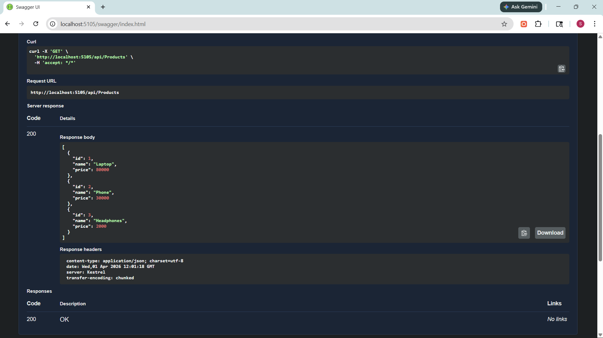

## API Testing (Swagger)

The API was tested using Swagger UI.

### Test Cases

1. Get All Products

   * Endpoint: GET /api/products
   * Result: Successfully returned list of products

2. Add Product

   * Endpoint: POST /api/products
   * Input: Product JSON
   * Result: Product created with unique ID

3. Get Product by ID

   * Endpoint: GET /api/products/{id}
   * Result: Correct product returned

4. Update Product

   * Endpoint: PUT /api/products/{id}
   * Result: Product updated successfully

5. Delete Product

   * Endpoint: DELETE /api/products/{id}
   * Result: Product removed from database

6. Error Handling

   * Endpoint: GET /api/products/999
   * Result: 404 Not Found returned

### Screenshots

