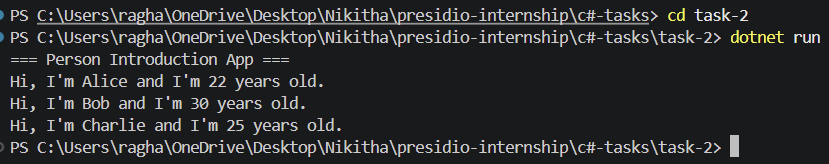

# Task 2: Simple OOP - Person Class

## 📌 Objective
Understand basic Object-Oriented Programming in C#.

## ⚙️ Features
- Created a Person class
- Added properties: Name, Age
- Implemented Introduce() method
- Instantiated multiple objects

## How to Run

- ```bash
- cd task-2
- dotnet run

## Output Screenshot


## Structure
task-2/
├── Program.cs
├── Person.cs
└── task-2.csproj

---

# 📸 6. Commit

git add .
git commit -m "Task 2: Implemented Person class with OOP concepts"
git push