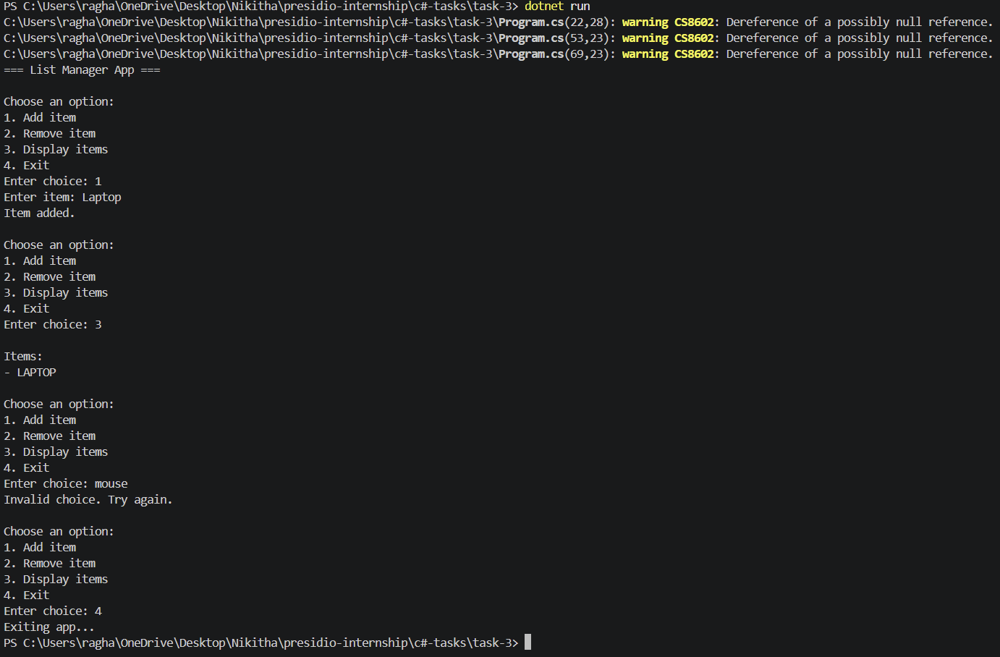

# Task 3: List Manager (Collections + Strings)

## 📌 Objective

Use collections and string manipulation to build a simple list manager in C#.

## ⚙️ Features

* Add items to a list
* Remove items from the list
* Display all items
* Clean user input using Trim() and ToUpper()

## 🛠️ Tech Used

* C#
* .NET SDK

## ▶️ How to Run

```
cd task-3
dotnet run
```

## 📸 Output Screenshot

(Add your screenshot here)

Example:



## 📂 Folder Structure

```
task-3/
├── Program.cs
├── task-3.csproj
└── README.md
```

## 🧠 Concepts Covered

* List<string>
* Loops (while, foreach)
* Switch statements
* String methods (Trim, ToUpper)
