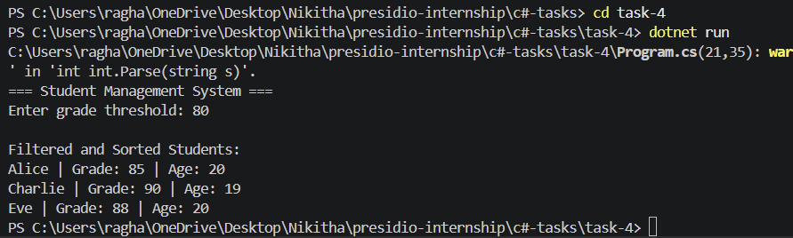

# Task 4: Student Management with LINQ

## Objective

Build a C# console application that manages student data using collections and LINQ.

## Features

* Created a Student class with Name, Grade, and Age
* Stored multiple students in a List<Student>
* Filtered students based on grade threshold
* Sorted filtered results using LINQ
* Displayed results in the console

## Technologies Used

* C#
* .NET SDK
* LINQ

## How to Run

```
cd task-4
dotnet run
```

## Output


## Folder Structure

```
task-4/
├── Program.cs
├── Student.cs
├── task-4.csproj
└── README.md
```

## Concepts Covered

* Collections (List<T>)
* LINQ (Where, OrderBy)
* Lambda expressions
* Object-oriented programming
