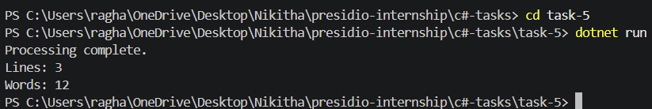

# Task 5: File I/O and Exception Handling

## Objective

Develop a C# console application that reads from and writes to files while handling possible exceptions.

## Features

* Reads text from an input file
* Counts number of lines and words
* Writes results to an output file
* Handles file-related exceptions

## Technologies Used

* C#
* .NET SDK
* System.IO

## How to Run

```
cd task-5
dotnet run
```

## Input File Example

```
Hello world
This is a sample file
C# file handling is useful
```

## Output



## Folder Structure

```
task-5/
├── Program.cs
├── input.txt
├── output.txt
├── task-5.csproj
└── README.md
```

## Concepts Covered

* File handling (ReadAllText, WriteAllText)
* Exception handling (try-catch)
* String processing
