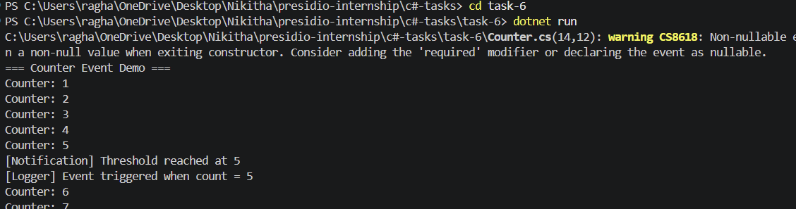

# Task 6: Delegates and Events in C#

## Objective

Demonstrate delegates and events by building a counter that triggers actions when a threshold is reached.

## Features

* Defined a delegate for event handling
* Created an event in the Counter class
* Triggered event when threshold is reached
* Subscribed multiple handlers to the event
* Demonstrated decoupled design

## Technologies Used

* C#
* .NET SDK

## How to Run

```
cd task-6
dotnet run
```

## Output


## Folder Structure

```
task-6/
├── Program.cs
├── Counter.cs
├── task-6.csproj
└── README.md
```

## Concepts Covered

* Delegates
* Events
* Event subscription
* Decoupled architecture
