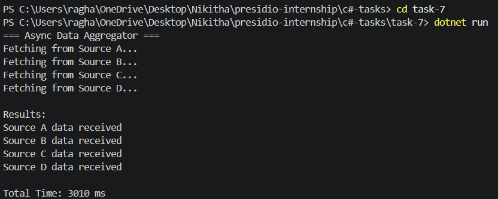

# Task 7: Asynchronous Programming and Multi-threading

## Objective

Develop a C# console application that performs multiple asynchronous operations concurrently and aggregates results.

## Features

* Simulated asynchronous data fetching using Task.Delay
* Concurrent execution using Task.WhenAll
* Aggregation of results from multiple sources
* Exception handling for individual tasks
* Performance measurement using Stopwatch

## Technologies Used

* C#
* .NET SDK
* async/await
* Task Parallel Library

## How to Run

```
cd task-7
dotnet run
```
## Output


## Folder Structure

```
task-7/
├── Program.cs
├── DataFetcher.cs
├── task-7.csproj
└── README.md
```

## Concepts Covered

* Asynchronous programming (async/await)
* Task parallelism (Task.WhenAll)
* Exception handling in async workflows
* Performance optimization
