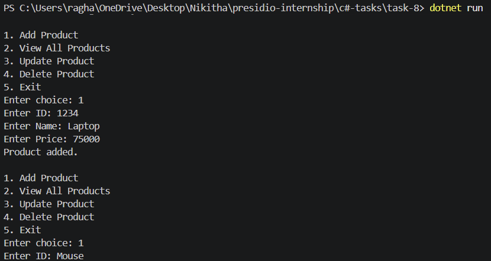

# Task 8: Generics and Repository Pattern

## Objective

Implement a generic in-memory repository using interfaces and generics to perform CRUD operations.

## Features

* Defined a generic IRepository<T> interface
* Implemented CRUD operations in InMemoryRepository<T>
* Used type constraints for generic handling
* Created a Product entity as an example
* Built a console UI for interaction

## Technologies Used

* C#
* .NET SDK
* Generics
* Interfaces

## How to Run

```
cd task-8
dotnet run
```

## Example Operations

* Add product
* View products
* Update product
* Delete product

## Folder Structure

```
task-8/
├── Models/
│   └── Product.cs
├── Interfaces/
│   └── IRepository.cs
├── Repositories/
│   └── InMemoryRepository.cs
├── Program.cs
├── task-8.csproj
└── README.md
```

## Output


## Concepts Covered

* Generics (T)
* Interfaces
* Repository pattern
* CRUD operations
* Separation of concerns
