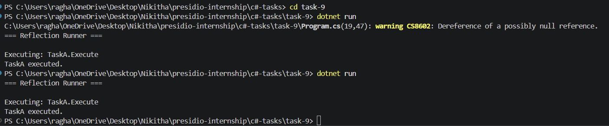

# Task 9: Reflection and Custom Attributes

## Objective

Build a C# application that uses reflection to discover and execute methods marked with a custom attribute.

## Features

* Defined a custom attribute [Runnable]
* Decorated methods across multiple classes
* Used reflection to scan assembly for marked methods
* Dynamically invoked discovered methods
* Displayed execution results in console

## Technologies Used

* C#
* .NET SDK
* Reflection (System.Reflection)
* Custom Attributes

## How to Run

```
cd task-9
dotnet run
```
## Output


## Folder Structure

```
task-9/
├── Attributes/
│   └── RunnableAttribute.cs
├── Tasks/
│   ├── TaskA.cs
│   └── TaskB.cs
├── Program.cs
├── task-9.csproj
└── README.md
```

## Concepts Covered

* Custom attributes
* Reflection
* Dynamic method invocation
* Assembly inspection
